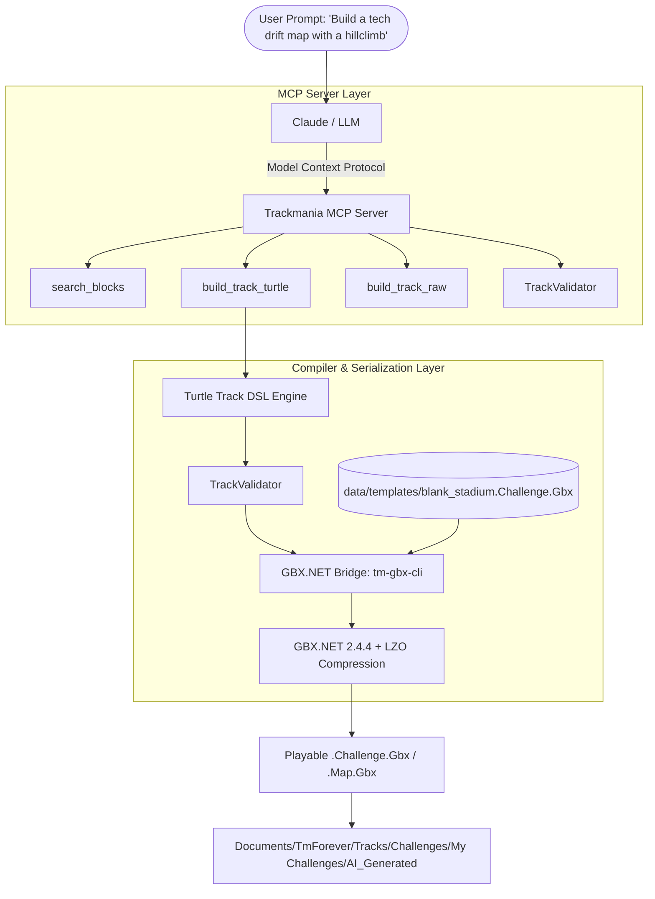

# 🏎️ Trackmania GBX MCP Server & Map Generator

[](https://opensource.org/licenses/MIT)
[](https://nodejs.org/)
[](https://dotnet.microsoft.com/)
[](https://modelcontextprotocol.io/)

An intelligent **Model Context Protocol (MCP) Server** and standalone CLI engine that enables LLMs (such as Claude, Antigravity, or ChatGPT) to design, validate, and compile playable **Trackmania GBX maps** (`.Challenge.Gbx` / `.Map.Gbx`) directly into the game.

Powered by **[GBX.NET](https://github.com/BigBang1112/gbx-net)** and a custom **Turtle Track-Builder DSL** that solves 3D spatial alignment challenges for generative AI.

---

## 🌟 Highlights

- **Dual-Mode Workflow:**
  - **Interactive MCP Server:** Connect Claude Desktop, Cursor, or Antigravity via MCP. Claude designs maps interactively, queries block catalogs, validates geometry, and writes `.Gbx` files directly into your game folder.
  - **Standalone CLI:** Don't have MCP? Just ask your LLM for JSON/DSL and run `node dist/cli.js build track.json --export`.
- **Turtle Track Builder (Relative DSL):** Prevents coordinate hallucinations by allowing sequential actions (`start -> forward(3) -> turbo -> turn_right -> slope_up -> checkpoint -> slope_down -> finish`). Features authentic 2x2 banked asphalt road curves (`StadiumRoadMainGTCurve2`), automatic 180° downhill ramp rotations, and seamless `Variant = 3` road connectivity.
- **MCP Prompts Ready:** Exposes `trackmania_designer` (comprehensive LLM track architect instructions) and `generate_track` (customized generation request).
- **Comprehensive LLM Design Guide:** See [`TRACK_DESIGN_GUIDE.md`](./TRACK_DESIGN_GUIDE.md) for full coordinate, footprint, slope stride, and pacing reference.
- **Built-in Track Validator:** Verifies Start/Finish integrity, warns of coordinate overlaps/collisions, and checks checkpoint pacing.
- **Pre-indexed Block Catalog:** Includes 236 indexed Stadium block types extracted from official Nadeo tracks with categories and frequency stats.
- **Reference Map Scraper:** Drop any `.Challenge.Gbx` or `.Map.Gbx` into `data/reference_maps/` and run `npm run cli -- catalog` to expand the block catalog.

---

## 🏗️ Architecture



---

## 🚀 Quickstart

### 1. Prerequisites
- **Node.js**: v20 or higher
- **.NET 8 SDK**: Required for compiling the binary GBX serialization engine.

### 2. Installation
Clone the repository and install dependencies:
```bash
git clone https://github.com/cheatoskar/llm-trackmania-map-generator.git
cd llm-trackmania-map-generator
npm install
npm run build
```

Compile the C# GBX engine:
```bash
cd tm-gbx-cli
dotnet build
cd ..
```

---

## 🤖 MCP Server Setup (Claude Desktop, Cursor, Antigravity)

Add this configuration to your `claude_desktop_config.json` (located at `%APPDATA%\Claude\claude_desktop_config.json` on Windows or `~/Library/Application Support/Claude/` on macOS):

```json
{
  "mcpServers": {
    "trackmania": {
      "command": "node",
      "args": [
        "C:\\path\\to\\llm-trackmania-map-generator\\dist\\index.js"
      ]
    }
  }
}
```

Once connected, Claude will have access to all trackbuilding tools:

| MCP Tool | Description |
| :--- | :--- |
| `search_blocks` | Query 236 Stadium blocks by category, surface, or keyword. |
| `build_track_turtle` | Build a track via sequential actions (`start`, `forward`, `slope_up`, `turn_right`, `checkpoint`, `finish`). Automatically computes 3D grid vectors. |
| `build_track_raw` | Build a track from an explicit list of block names, coordinates, and directions. |
| `inspect_map` | Analyze any `.Gbx` map and return author, block list, and statistics. |
| `list_reference_maps`| List all maps currently placed in `data/reference_maps/`. |
| `export_to_game` | Copy any generated track directly to your Trackmania user folder. |

---

## 💻 Standalone CLI Usage (Without MCP)

If you prefer having the LLM output raw JSON or Turtle DSL files:

### Build from Turtle DSL (Recommended)
```bash
node dist/cli.js turtle examples/turtle_track.json --export
```

### Build from Raw Block JSON
```bash
node dist/cli.js build examples/simple_sprint.json --export
```

### Inspect any existing Map
```bash
node dist/cli.js inspect examples/AI_Turtle_Hillclimb.Challenge.Gbx
```

### Re-scan Reference Maps & Update Block Catalog
```bash
npm run cli -- catalog
```

---

## 📂 Reference Maps & Templates

Where should you place reference maps?

```
data/
├── reference_maps/    # Drop any .Challenge.Gbx or .Map.Gbx here!
├── templates/         # Clean template maps (e.g. blank_stadium.Challenge.Gbx)
└── block_catalog.json # Indexed blocks with frequency and coordinates
```

- When you add new tracks into `data/reference_maps/`, run `npm run cli -- catalog`. The tool will automatically parse the files, find all unique blocks, categorize them, and update `data/block_catalog.json`.

---

## 📄 Track DSL Examples

### Turtle DSL (`turtle_track.json`)
```json
{
  "mapName": "AI Mountain Sprint",
  "author": "Claude AI",
  "startX": 16,
  "startY": 9,
  "startZ": 10,
  "initialDirection": "North",
  "steps": [
    { "action": "start" },
    { "action": "forward", "count": 3 },
    { "action": "slope_up" },
    { "action": "forward", "count": 2 },
    { "action": "checkpoint" },
    { "action": "slope_down" },
    { "action": "forward", "count": 2 },
    { "action": "finish" }
  ]
}
```

### Raw JSON (`simple_sprint.json`)
```json
{
  "mapName": "AI Stadium Sprint",
  "author": "Claude AI",
  "blocks": [
    { "name": "StadiumRoadMainStartLine", "x": 16, "y": 9, "z": 10, "dir": "North" },
    { "name": "StadiumRoadMain", "x": 16, "y": 9, "z": 11, "dir": "North" },
    { "name": "StadiumCheckpointRingV", "x": 16, "y": 9, "z": 12, "dir": "North" },
    { "name": "StadiumRoadMain", "x": 16, "y": 9, "z": 13, "dir": "North" },
    { "name": "StadiumRoadMainFinishLine", "x": 16, "y": 9, "z": 14, "dir": "North" }
  ]
}
```

---

## ⚖️ License & Legal Attribution

- This project is licensed under the [MIT License](LICENSE).
- **[GBX.NET](https://github.com/BigBang1112/gbx-net)** is developed by BigBang1112 and licensed under the Apache 2.0 / MIT License.
- **Model Context Protocol (MCP)** is developed by Anthropic, PBC.
- **Disclaimer:** Trackmania and Nadeo are registered trademarks of Ubisoft Nadeo. This is an unofficial, open-source community tool and is not affiliated with or endorsed by Ubisoft or Nadeo.
